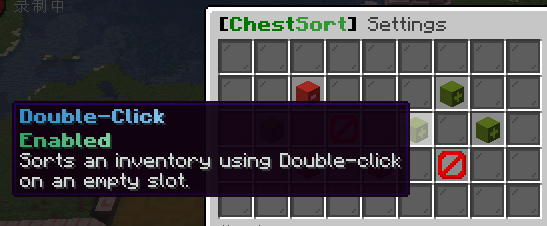

---
layout:
  title:
    visible: true
  description:
    visible: false
  tableOfContents:
    visible: true
  outline:
    visible: true
  pagination:
    visible: true
---

# 查询插件

## 插件介绍

顾名思义查询各种记录的插件，同时可以回档，被熊不用怕!直接在群里找带“回档”标志的管理回档即可

## 插件指令

#### <mark style="color:orange;">**查询**</mark>&#x20;

输入指令后点击方块即可，<mark style="color:red;">取消查询再次输入指令，即可退出</mark>

**命令:** `/co i`

**提示:** 检查箱子被偷请右键箱子，挖掘需手持方块对着被破坏的位置放置，检查放置为左键点击被放置的方块

<figure><figcaption>
命令示例，inspect 也可以使用简写 i
</figcaption></figure>

<figure><figcaption>
可以看到神里绫华往箱子放了钻石。
</figcaption></figure>

#### <mark style="color:orange;">范围查询</mark>

输入命令可查询范围内的操作(容器操作请使用上方的`/co i`查询)

**命令:** `/co near <范围>`

**提示:** 不建议输入太大的范围，插件无法查询那么大的范围，一般建议最大范围为30

<figure><figcaption>
命令示例, 3为本次查询的范围
</figcaption></figure>

<figure><figcaption>
可以看到PowerAre在这附近丢出又捡回了26个面包
</figcaption></figure>

